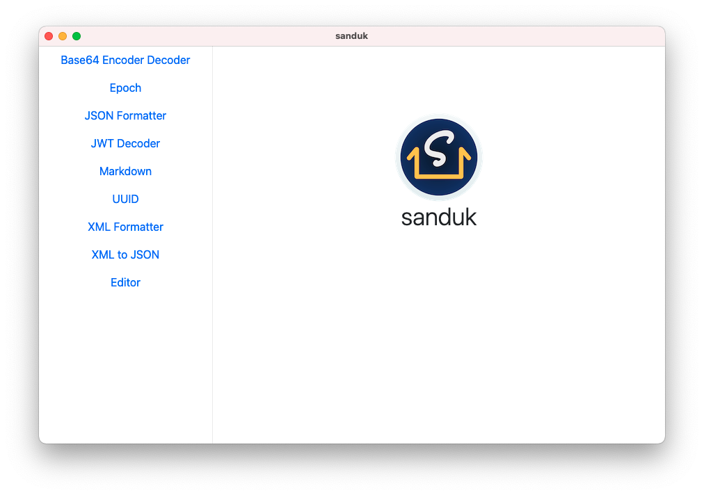

# sanduk

[](https://github.com/yusufshakeel/sanduk)
[](https://www.npmjs.com/package/sanduk)

Helper app for development.

Sanduk (Sandooq) in English means "Box".



## Build and run in 3 steps

1. Clone the project

```
git clone https://github.com/yusufshakeel/sanduk.git
```

2. Install modules

```
npm install
```

3. Build dmg for macOS

```
npm run build:for-mac
```

A `dist` directory will be created which will have the dmg file.

## License

It's free :smiley:

[MIT License](https://github.com/yusufshakeel/sanduk/blob/master/LICENSE) Copyright (c) 2021 Yusuf Shakeel

### Back this project

If you find this project useful and interesting then feel free to support it on [Patreon](https://www.patreon.com/yusufshakeel).

### Donate

Feeling generous :smiley: [Donate via PayPal](https://www.paypal.me/yusufshakeel)
